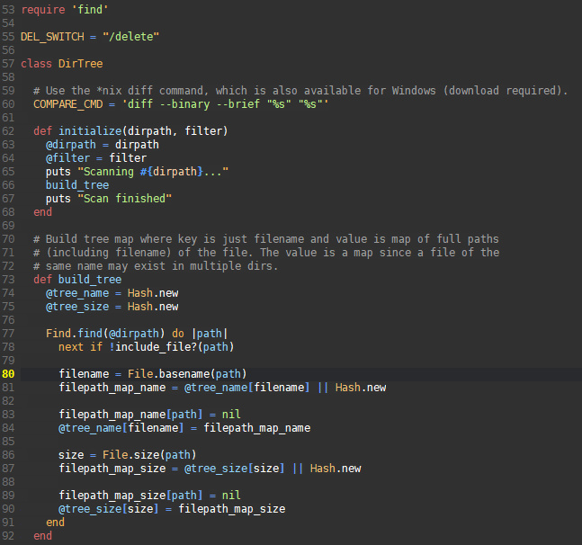
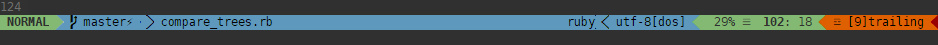

This repository contains files that affect how GVim appears.

# deep-onyx.vim

Here's a screenshot of a Ruby file:

This is a Vim theme intended to to be used in GVim. It may be fine in a terminal with true colour support, such as [ConEmu](https://conemu.github.io/).

To use the theme:

1. Copy `deep-onyx.vim` to `~/.vim/colors` (Linux) or `%USERPROFILE%/vimfiles/colors` (Windows).
2. Add `colorscheme deep-onyx` to your `vimrc` file (generic Vim setup) or `.vimrc` (Linux) or `_vimrc` (Windows).

# bubblegum2.vim

This is a [vim-airline]() theme. Here's a screenshot in normal mode:

To use the theme:

1. Copy `bubblegum2.vim` to `~/.vim/autoload/airline/themes` (Linux) or `%USERPROFILE%/vimfiles/autoload/airline/themes` (Windows).
2. Add `let g:airline_theme='bubblegum2'` to your `vimrc` file (generic Vim setup) or `.vimrc` (Linux) or `_vimrc` (Windows).
